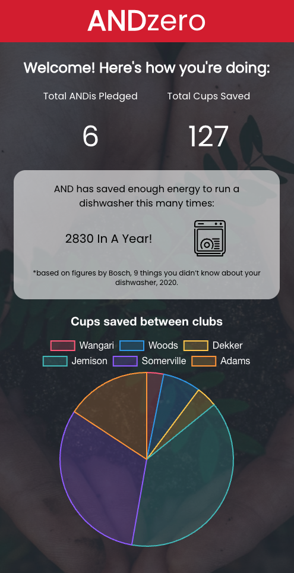

# ANDzero front end

## About

This app is a prototype for an application that we could use to improve sustainability in the office

> "Through this app and short questionnaire, we can measure how you can improve your sustainability and the impact you can have, purely through pledging to use a reusable coffee cup."


## Tech:

- React
- Tailwind
- Daisy UI
- Chart.js


## To run:
Ensure you have all dependencies installed:
```
npm i
```
Run the React app:
```
npm run start
```

In order to view the data, you will also need to have the backend running. The backend repository and instructions to run can be found [here](https://github.com/alec-hamilton/and-zero-be)

---

## Screenshots

